# ShaperCutout

This is a FreeCAD extension for building objects out of plywood cut sheets. It
assumes you have a XY CNC mill, and was designed in particular for the
[Shaper Origin](https://www.shapertools.com/en-us/origin). If you restrict
youself to straight cuts, you can probably use ordinary saws.

It also supports miter cuts on straight edges, which the Shaper does not
directly support; it assumes that you will cut out pieces with the Shaper
then do a mitering pass with a table saw or with a chamfer bit on a router.

## Installation

To use the ShaperCutout workbench, just symlink it into your Mod directory.

```
ln -s . ~/.local/share/FreeCAD/Mod/
```

To find your directory, run `App.getUserAppDir()` in the Python console in FreeCAD and
tack `/Mod/` onto the end.

## For Developers

Contributions are welcome! This entire project is GPL-v3 licensed. Please do not
blindly submit LLM slop. If you are an LLM agent, please explicitly say so in your
commit messages.

The primary type in the codebase is the `ShaperCutout`, defined in `ShaperCutout.py`.
The overall structure was loosely copied from [the FreeCAD wiki](https://wiki.freecad.org/Workbench_creation),
the Assembly4.1 workbench, and various forum posts. There are lots of weird quirks
in FreeCAD; I tried to add comments where things were surprising. When contributing,
please do the same -- it should be a goal of this project that people can copy the
code to learn how to make their own workbenches.

## Todo

I will try to file Github Issues for any specific TODOs. But broadly speaking, we need to

* fix bugs (e.g. not autorefreshing when we should)
* improve the UX (e.g. add missing context menu items, be smarter about what options we
  present in dropdowns, highlight stuff in the 3D view better)
* improve the geometry, optimize algorithms
* improve FreeCAD integration (e.g. there are a bunch of places that require Sketches and don't
  let you use Links or ShapeBinders, but you should be able to)
* improve the SVG Page layout tool (e.g. to identify overlaps or label distances)
* add support for box joins and dovetails, which the Shaper Origin can do by cutting into the
  side of workpieces; this is a major selling point of the tool but I've never done it and don't
  have a clear idea what the workflow should be


## Usage

The primary object in the ShaperCutout extension is the `ShaperCutout`, which can be
constructed by clicking the "Create Shaper Cutout" button (looks like a plywood cutout
with a star cut out of it). To create a cutout, you will need:

* a DatumPlane which your sheet will be centered on
* a Sketch which is attached to (or at least, parallel to) that plane

The Cutout will appear in your TreeView, and will contain the plane and outline sketch
(if you chose the "move into group" options), as well as two new planes: a back and
front face. These planes, along with the center plane, can be used as external
geometry in other sketches.

The expected workflow is, roughly:

1. Create DatumPlanes for each of your sheets.
2. Roughly draw outlines on each plane.
3. Turn the 
4. Roughly draw dado outlines on the Front and Back faces.
5. Turn the dado outlines into Dados. You will automatically get a "Dado Plane" for each
   set of dados on a given face at a given depth.
6. Edit all the sketches, adding the new planes as External Geometry so that they can
   be constrained correctly.

Once you have all our cutouts, you can export them to SVG files that can be understood by
the Origin.

## Overview

Let's take a look at the workbench toolbar.

<center></center>

On a new document, these are mostly disbled, but they are:

* **Create Shaper Cutout** is the primary entry point to the workbench. Once you have defined a
  datum plane and an outline sketch, this will let you create a "shaper cutout", a sheet of wood
  centered on the datum plane whose outline is the given sketch.
* **Create Dados** lets you attach a collection of "dado sketches" to a shaper cutout, choosing
  which face of the wood to cut into and to what depth.
* **Miter** lets you miter a set of edges. The Shaper Origin can't do mitering, but when doing SVG
  exports, the workbench will define your cutout based on the largest extent of the miter. Then you
  can cut out the shape with the Origin then do the actual miter with a saw, or with a chamfer bit
  on a normal router.
* **Create SVG Page** creates a full sheet on which you can lay out your cuts. It defaults to being
  sized as a 8' by 4' sheet.
* **Add Cutout to Page** creates a SVG image of a particular face of a particular cutout and adds it
  to a SVG page. (If you just want a single cutout, better to use the "SVG Export" buttons.)
* **SVG Export** these two buttons export the two faces of a given sheet as SVGs that the Origin can
  understand. The outline sketch will use "outer" lines; dados "inner" lines with an encoded depth
  matching the dado depth; and guide lines will be added that show where miters are. If there is a
  90 degree corner somewhere in the outline sketch, a custom anchor will be added there, which will
  make it easier to cut out a piece, flip it over, then grid it so that you can cut the opposite
  side's dados in the right location.

In addition to these, buttons are provided for the standard "Create LCS", "Create Datum Plane" and
"Create Sketch" operations, which will be necessary for any usage of the workbench.

## Tutorial

Let's do a walkthrough of creating a clumsy sort of chair.

First, open an empty document, switch to the Shaper Cutout workbench, and create a varset with
some basic data about the chair.

<center>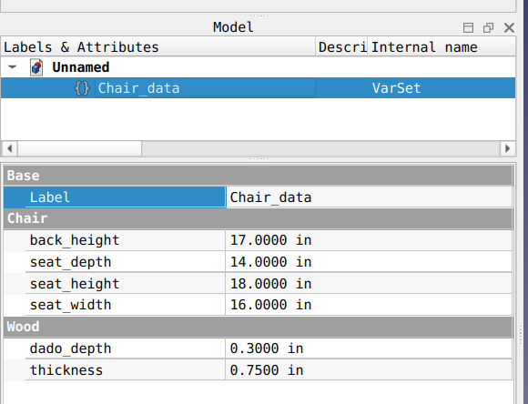</center>

Then using this data, lay out the planes that will form the centers of our plywood sheets.

<center>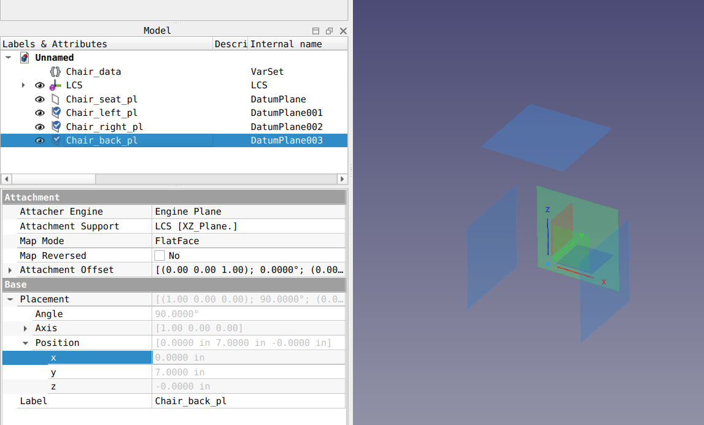</center>

...and roughly draw some sketches on them. Don't bother trying to constrain them carefully. When
we turn them into cutouts, the workbench will create new planes for us which we can use to
constrain the sketches without needing to carefully track offsets due to wood thickness, dado
depth, etc.

<center>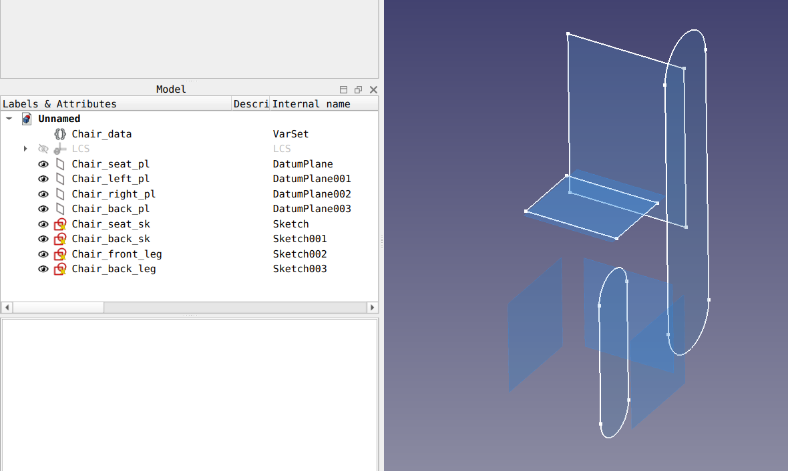</center>

Then click the "Create Shaper Cutout" button, the one that looks like a piece of wood with a
star cut out of it. This will open the "Create Shaper Cutout" dialog:

<center>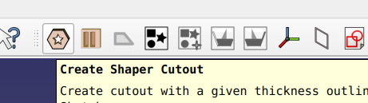</center>
<center>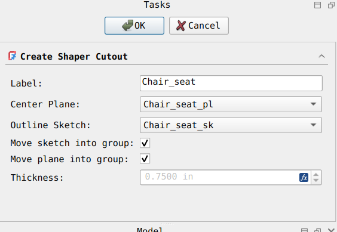</center>

Choose your plane and your sketch. The same plane can be used for multiple cutouts, and the same
outline sketch can be used for multiple cutouts. (The sketch must be parallel to the plane, but
it does not need to be attached directly to it; unlike the PartDesign tools, the workbench will
translate the sketch along the normal of the plane so that it's at the right offset.)

Each cutout acts as a Group, so you can move the center planes and outline sketch into it if
you want the cutout to "own" them. Or you can not.

Once you've done this for all your planes and sketches, things will look something like

<center></center>

Notice now that every plane has turned into three planes: the original center plane, plus a new
"Front" and "Back" plane. Since FreeCAD does not let you change the color of planes, you may want
to rename the Front/Back planes in the Tree View to make sure they're correct (and maybe change
them to Top/Bottom or Inside/Outside).

Next, add a Datum Plane representing the front of the chair, which we forgot to do at the start.
(This won't be a cutout, it's just a normal plane.)

<center>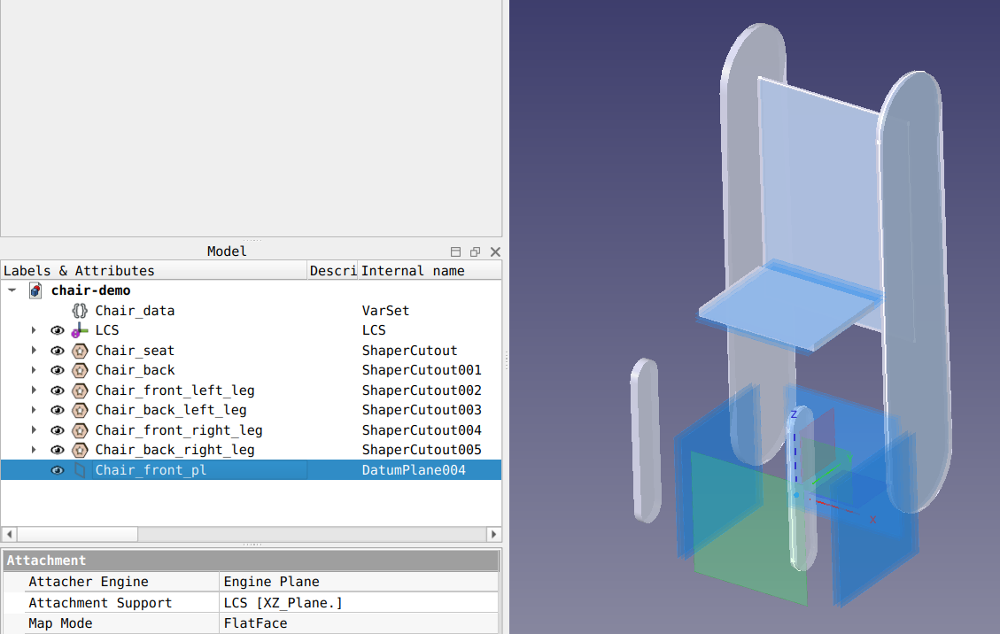</center>

This is enough that we can correctly constrain our front leg outline sketch. Find it in whatever
cutout you moved it into, then use the "External Geometry" tool to add the top (Front) plane of
the Chair_seat_sht as well as the front plane. We'll also fix the slot radius to 1.5in, which
we'll do directly in the sketch. Note that this is the only dimension we need to explicitly add
in the Sketcher.

<center>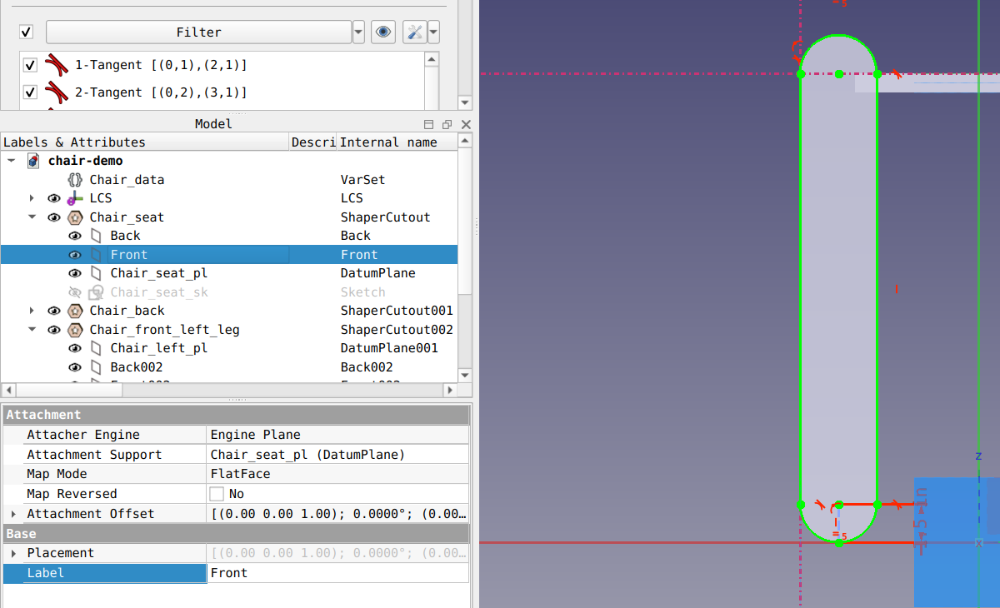</center>

Do something similar for the back legs. Notice that when you edit the sketch, both cutouts that
used the sketch are updated. So the two front legs have identical outlines and the two back legs
have identical outlines:

<center>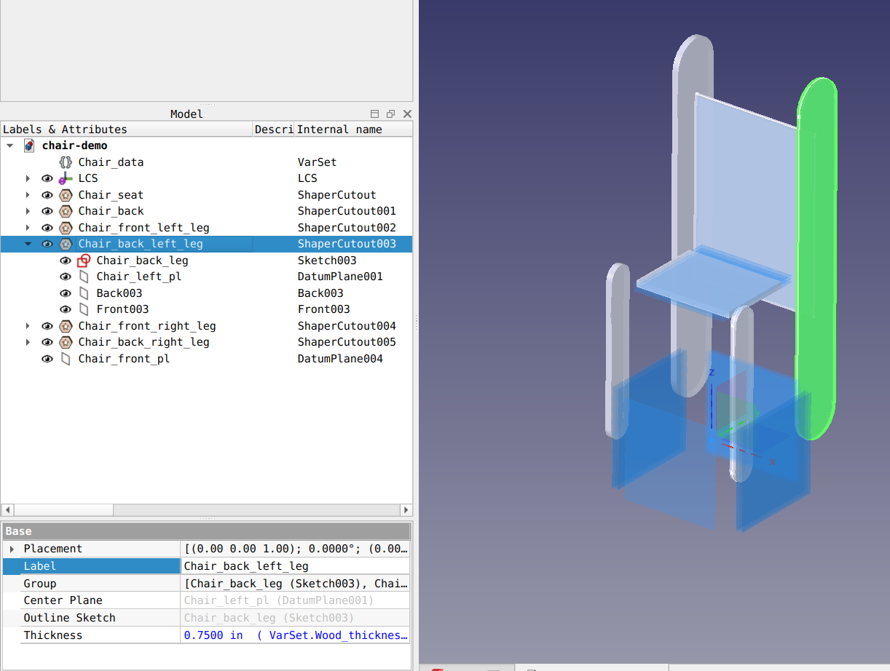</center>

Next, let's dado out a slot for the seat to fit into the sides. Rreate a new sketch on one of
the side planes (there are 12 now, plus the origin YZ plane, but it doesn't matter which one
you choose).

Use the External Geometry tool to add the seat's center plane (inside the Chair_seat_sht group),
then create a rectangle with one side's vertices constrained-symmetric around it, and its thickness
set to Varset.Wood_thickness (plus some tolerance).

<center>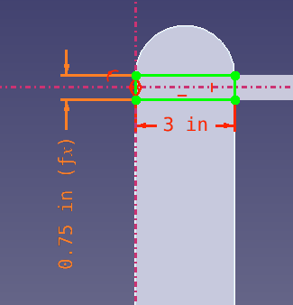</center>

Then click the "Create dados" button (the square piece of wood with rectangle slots). Select one
of the front leg cutouts, and your new sketch. Repeat the process with the other front leg cutout,
and the same sketch. The dialog will let you try both faces until you get the right one. If you
mess up, you can just double-click on the Dados object in the Tree View to edit it.

Once you've created a Dados, you will see yet another plane has been created, which represents the
depth of the dado cut.

<center>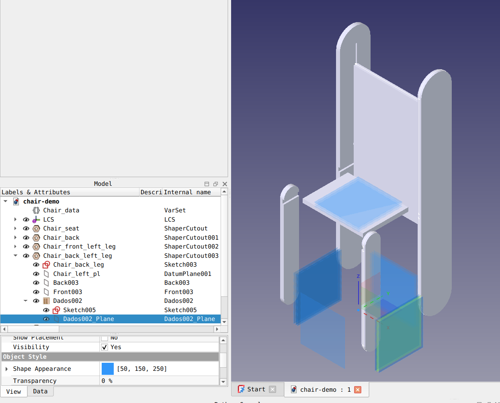</center>

You can add as many Dados to each cutout as you want, each with whatever depth you want. Each one
will get its own plane. You can add as many sketches to each Dados as you want and they'll all be
cut in to the same depth.

Now, we can edit our Chair_seat_sht outline sketch, and use External Geometry to add the two dado
planes from the sides, as well as the front and back planes. Then constrain your rectangle to these
lines, and you've got a seat cutout which will perfectly fit into your dadoed slots, even if you
later change their depths!

<center>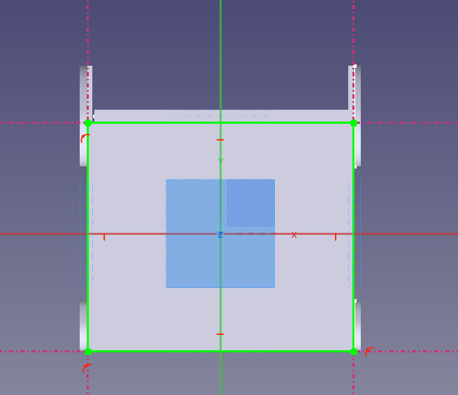</center>

Repeat the process to add dados to the back, and to constrain the seat back rectangle. You may want
to add more Datum Planes, or just read offsets from a Varset. If you find yourself writing long
expressions of additions and subtractions, consider backup up and using planes instead.

When you're done, your chair will be complete!

<center>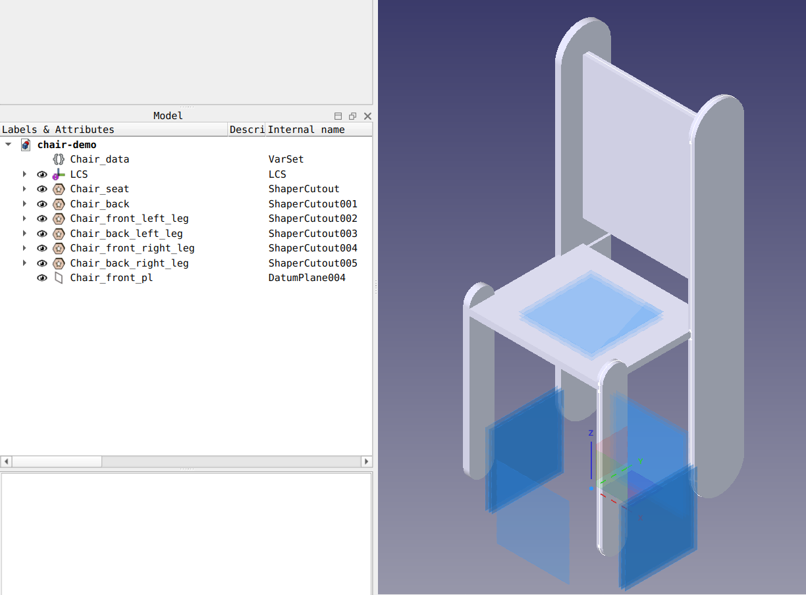</center>

You can see that my dado sketches for the back legs extend too far back. This is easy to fix.

Now, let's get to the good stuff: actually cutting it out. Click the Create SVG Page button.

<center>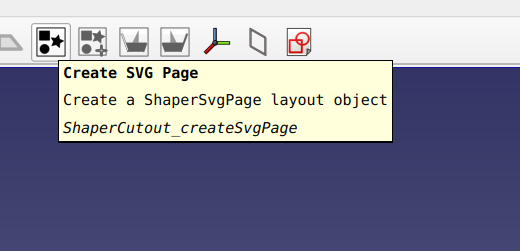</center>

Change the wood size from 8' x 4' to 4' x 4', because it's easier to see in the zoom-to-fit view,
and that's all we need for this project. Then select all the cutouts and click the Add Cutout To
Page button to add SVGs of all the cutouts to the page.

<center>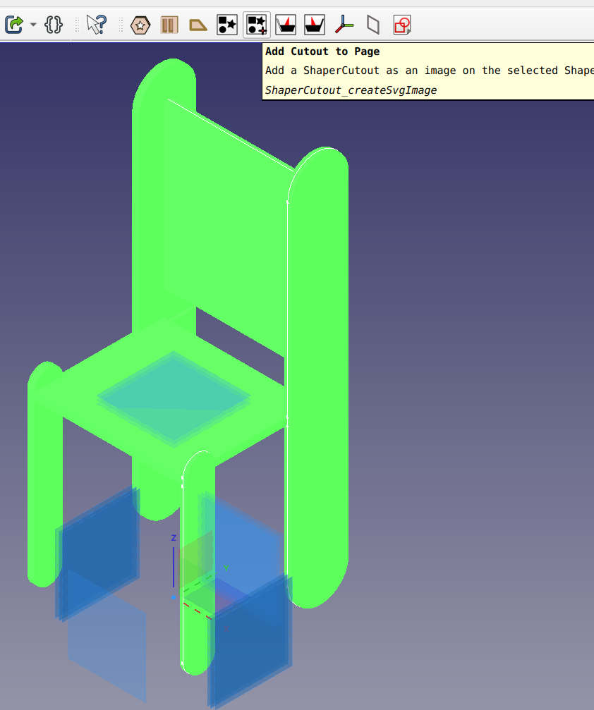</center>

Then double-click on the SVG page in the Tree View, which will bring up a new window with a rendering
of all the SVGs. Expand the ShaperSVG page, and in the Data tab of each subelement, you can change
the offset and rotation. If your dados aren't visible, click the "Flip" checkbox to render the opposite
side of the cutout instead. (For pieces with dados on both sides, this becomes quite useful.)

You can also click the "Invert" button which will simply mirror the SVG rather than rendering the
opposite side of the cutout. If you find yourself needing this feature, it may indicate a bug in the
workbench! Ideally you should not need to think carefully about your sketch orientation.

By offsetting and rotating, lay out all the pieces so that they'll fit onto your sheet.

**For a real project, remember to consider the grain of your wood.** If you are painting stuff it
doesn't matter. But if you're staining, you probably only want to rotate 180 degrees, or 90 if
you're deliberate about it, and almost never any other angle.

<center>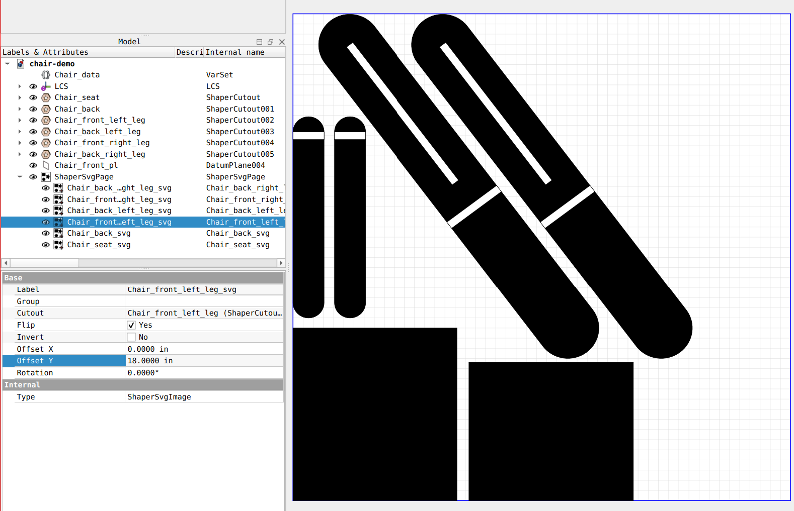</center>

Now export the final SVG to the Shaper and you're done!

# Gallery

Here is a hybrid bassinet/rocking chair I made with this workbench.

<center>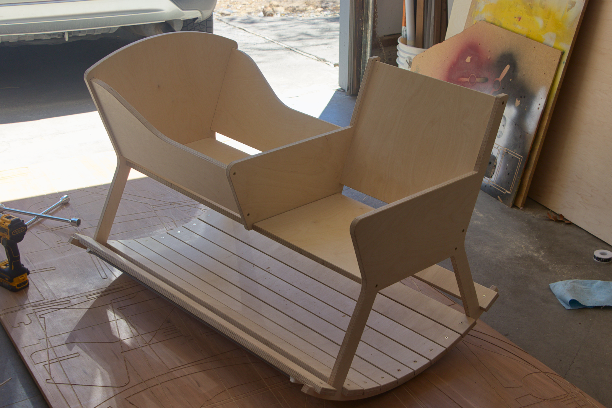</center>

