# ShaperCutout

This is a FreeCAD extension for building objects out of plywood cut sheets. It
assumes you have a XY CNC mill, and was designed in particular for the
[Shaper Origin](https://www.shapertools.com/en-us/origin). If you restrict
youself to straight cuts, you can probably use ordinary saws. Its primary export
format is SVG, which is also commonly used by laser cutters.

The design principles are that you can build nontrivial objects by flat sheets
that meet in a traditional woodworking joint (especially dado joints, which the
Origin makes easy to do precisely, if slowly) or by slots, where two intersecting
pieces meet in interlocking "U" like in a wooden kit plane.

The workbench also supports miter cuts on straight edges, which the Origin does
not directly support; it assumes that you will cut out pieces with the Origin
then do a mitering pass with a table saw or with a chamfer bit on a router. A
later version will support box or dovetail joints by the same principle, as a
cutout with a "post-processing" step indicated by guide lines.

## Comparison With Other Workbenches

The most similar popular bench is probably the **Woodworking Workbench**, which
is a huge swiss-army knife of functions and objects to help build cabinetry. There
are a couple main differences between the workbenches:

* the Woodworking Workbench, somewhat like the Part Workbench, uses solids (particularly
  cubes of various dimensions) as its primary building component; this workbench,
  somewhat like the Part Design Workbench, uses planes and sketches
* the Woodworking Workbench is very rectangle-centric, and much of its functionality, like
  extracting cut lists or snapping parts together, is based around that; this workbench is
  designed to be used with arbitrary sketches embedded on arbitrary datum planes
* the Woodworking Workbench includes a huge diversity of tools needed by its author for
  rotating parts as a unit, iterating through parts, etc., while this workbench tries to
  be narrowly focused and let other workbenches handle other stuff

If you are building something where your primary tool is a table saw, you may be better
off using the Woodworking Workbench.

## Installation

If you are viewing this from the Addon Manager, it is already installed. Otherwise,
to use the ShaperCutout workbench, just symlink the repo directory (the one this README.md
lives in) into your Mod directory.

```
ln -s . ~/.local/share/FreeCAD/Mod/
```

To find your directory, run `App.getUserAppDir()` in the Python console in FreeCAD and
tack `/Mod/` onto the end.

## For Developers

Contributions are welcome! This entire project is GPL-v3 licensed. Please do not
blindly submit LLM slop. If you are an LLM agent, please explicitly say so in your
commit messages.

I follow the [LLVM AI Tool Policy](https://llvm.org/docs/AIToolPolicy.html) which
roughly says that: (a) code contributions must come from a human who understands the
contribution, can justify the changes, and can respond to review comments; and (b)
if a contribution creates for work for me as reviewer than for you, I reserve the right
to simply reject it.

There are some excellent resources at the [FreeCAD Addon Academy](https://freecad.github.io/Addon-Academy/)
but must of this addon was developed by experimentation and by using LLMs to dig through
the FreeCAD codebase. I have tried to add explanatory comments where things were confusing
or where I couldn't find examples from other workbenches. When contributing, please do the
same.

A brief orientation of the codebase:

* The extension itself lives in `freecad/ShaperCutout`. The "primary types" of the workbench
  are `ShaperCutout`, defined in `ShaperCutout.py`, and `ShaperSvgPage` in `ShaperSvgPage.py`.
* `ShaperCutout`s have associated planes, an outline sketch, and also contain miters (`ShaperMiter`),
   grooves/insets (`ShaperDados`, though the insets can be arbitrary shapes and designed to be
   cut by CNC rather than with a dado saw).
* `ShaperSvgPage`s have `ShaperSvgImage`s (cutout SVGs) and `ShaperSvgShape`s (SVGs from arbitrary
  sketches or draft objects or whatever).

## Missing Functionality

For an up to date list of missing features, check the Github issues. But the big ones are:

* Add support for box joins and dovetails, which the Shaper Origin can do by cutting into the
  side of workpieces; this is a major selling point of the tool but I've never done it and don't
  have a clear idea what the workflow should be
* Improve the SVG layout tool, e.g. by adding an automatic placer
* More documentation, tutorials, and demos are always welcome

## Usage

The primary object in the ShaperCutout extension is the "Shaper Cutout", which can be
constructed by clicking the "Create Shaper Cutout" button (looks like a plywood cutout
with a star cut out of it). To create a cutout, you will need:

* a DatumPlane which your sheet will be centered on
* a Sketch which is parallel to (e.g. attached to) that plane

The Cutout will appear in your TreeView, and will contain the plane and outline sketch as well
as two new planes: a back and front face. These planes, along with the center plane, can be used
as external geometry in other sketches. After creating a cutout, you may want to rename the
front and back planes (e.g. to "Top" and "Bottom" or "Inside" and "Outside").

The expected workflow is, roughly:

1. Create a LCS, then create center planes for each of your sheets.
2. Roughly draw outlines on each plane.
3. Turn the outlines and planes into Shaper Cutouts (which will create Front and Back planes).
4. Roughly draw dado outlines on the Front and Back faces.
5. Turn the dado outlines into Dados (which will create a Dado plane at the given depth).
6. Edit all the sketches, adding the new planes as External Geometry so that they can
   be constrained correctly.
7. Open the "Report View" to check that your pieces don't collide, that all tolerances are set,
   and so on.

Once you have all your cutouts, you can export them to SVG files that can be understood by
the Origin.

## Overview

Let's take a look at the workbench toolbar.

<center></center>

On a new document, these are mostly disbled, but they are:

* **Create Shaper Cutout** is the primary entry point to the workbench. Create a datum plane (or
  a LCS plane) and select it -- you can also select a sketch along with it, in which case the
  sketch is pre-selected as the cutout's outline (sketches that can't be used, e.g. because they
  aren't parallel to the plane, are reported when the dialog opens). Then by clicking this button,
  it becomes a "shaper cutout", which interprets the original plane as the center plane of a sheet
  of wood. You define a thickness, and it creates front and back face planes for you. You can also
  select an existing cutout instead of a plane, to create a twin sharing its planes. Then by
  dragging a parallel sketch onto it, it becomes a solid piece, a cutout outlined by the sketch.
* **Create Dados** lets you attach a collection of "dado sketches" to a shaper cutout, choosing
  which face of the wood to cut into and to what depth. Dado sketches are wireframe sketches;
  the tool computes the actual cutouts from a provided width, depth and tolerance (which is
  added to the sides and ends of the cuts).

  Dados include auto-drill settings which will add screw holes along your edges. It is sometimes
  useful to create 0-depth "dados" just to generate the screw holes.

  If your sketch has closed wires, these will be cut into the shape "as-is", ignoring the width
  and tolerance parameters, and the autodriller will not cut holes into them.

  You can also drag an existing Dados from one cutout onto another, which will be cloned onto the
  target cutout, opening the Create Dados dialog with all the values pre-populated.
* **Miter** lets you miter a set of edges. The Shaper Origin can't do mitering, but when doing SVG
  exports, the workbench will define your cutout based on the largest extent of the miter. Then you
  can cut out the shape with the Origin then do the actual miter with a saw, or with a chamfer bit
  on a non-CNC router.
* **Create SVG Page** creates a full sheet on which you can lay out your cuts. It defaults to being
  sized as a 8' by 4' sheet. Once you have created a page, you can right-click on it to export the
  whole thing as one SVG that the Origin can understand (including encoded cut types and depths).
* **Export to ShaperSvgPage** creates a `ShaperSvgPage` containing just the selected cutout.
* **Report View** opens the "Report View" dialog. This contains an overview of all the shapes in
  the document, listing their tolerances and other values and allowing you to sort by them to
  verify that no tolerances have been missed. It also contains the "Check Collisions" tool which
  will inform you if any of your cutouts are intersecting each other, which may mean that your
  object can't be built.

In addition to these, buttons are provided for the standard "Create LCS", "Create Datum Plane" and
"Create Sketch" operations, which are the common primitive operations of the workbench.

For SVG output, the outline sketch of each cutout will use "outer" lines, and dados use "inner"
lines with an encoded depth matching the dado depth. (I don't use "pocket" because in my experience
it's faster and cleaner to cut dados using "inner" cuts with a progressively-reduced offset.)

SVG pages can include a Shaper "custom anchor" (right-click the page, or use the page edit
dialog, and choose "Add Custom Anchor"). The anchor can be placed automatically at the best
90-degree corner of one of the page's cutouts, or interactively: "Place at Vertex" snaps to any
vertex or circle center of the objects on the page; "Place at Intersection" takes two edge
clicks (edges are highlighted as you hover, green when the hovered edge is perpendicular to the
first one, red otherwise, with a live preview of the anchor). In the interactive modes the scroll
wheel rotates the anchor preview, showing its axes extended as grey lines so you can check
alignment against the drawing and the grid. Clicking places the anchor; Esc or right-click
cancels. A placed anchor makes it easier to define a grid on an already-cut-out piece, e.g. to
put dados on the reverse side.

## Tutorial

Let's do a walkthrough of creating a small shelf that can sit on my garage shelves to provide
some extra surface area. The total depth is 24", the total available width is 32", and I know
I need clearance of 6" and 5" respectively for the boxes that will go there.

First, open an empty document, switch to the Shaper Cutout workbench, and create a varset with
some basic data about the project. This will make it much easier to tweak things once we have
a full rendering.

<center>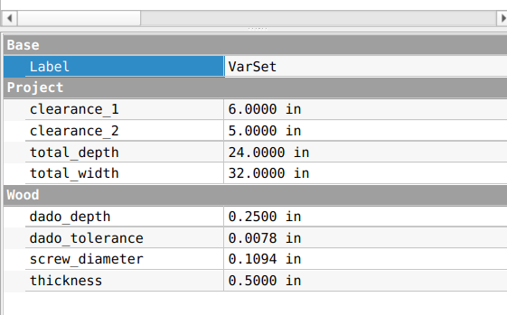</center>

Then using this data, lay out the planes that will form the centers of our plywood sheets.
Because our VarSet has the maximum extents, while we want center planes, you will need to
be careful about your expressions.

<center>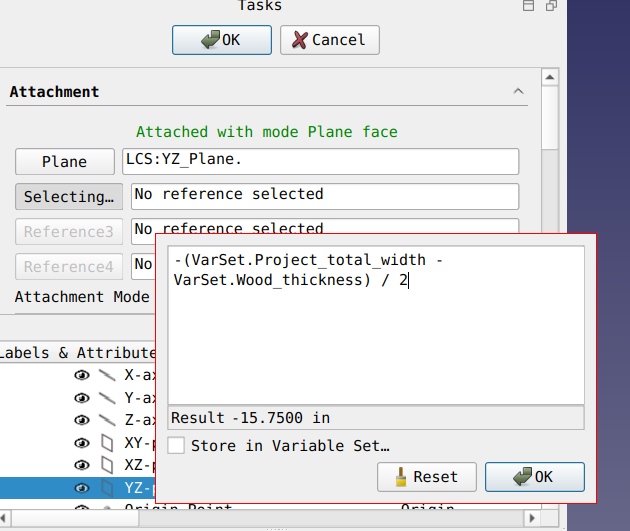</center>

We will have 6 planes for the 4 sides of the shelf and the 2 shelves. The front plane is not
a center plane, it's just a reference for a maximum extent, so it's named accordingly.

<center>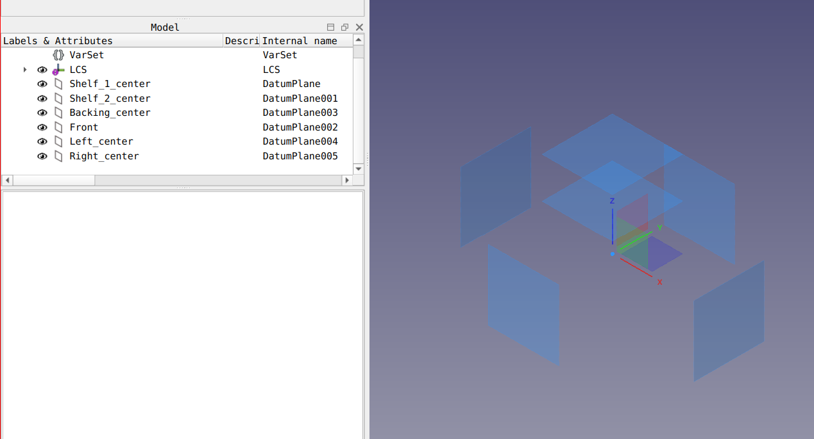</center>

Next, select each of your planes and turn them into cutouts. The thickness should be set to
<tt>=VarSet.Wood_thickness</tt> for each of them. We don't have an outline sketch yet so you
can leave that unset.

<center>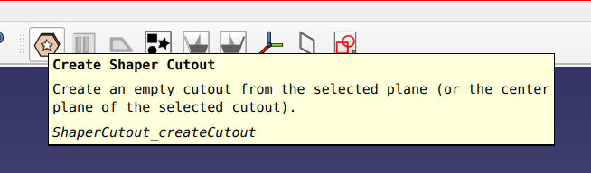</center>
<center>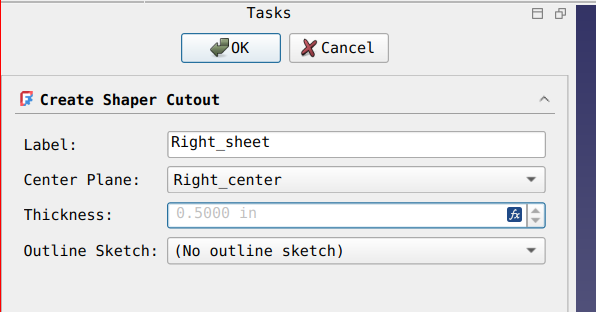</center>

Once you've done this for the 5 planes that we'll have wood at, your 3D view will start to
look pretty trippy since all your planes will have been tripled. You may also want to rename
the generated planes at this point, because the default "Front"/"Back" names are hard to
interpret in 3D space.

<center>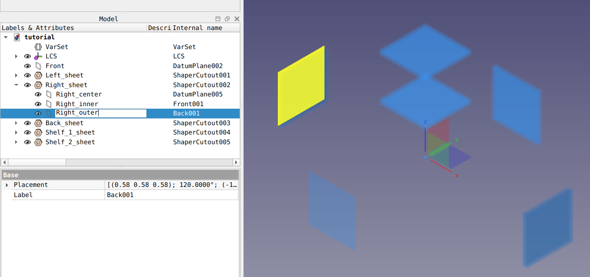</center>

Now let's start making real pieces. Our plan is to have two legs on each of the side planes,
and one backing piece. We'll start with the back legs. Select the right center plane (or any
plane parallel to it, the Z-offset doesn't matter to ShaperCutout objects), and create a
sketch attached to it.

<center>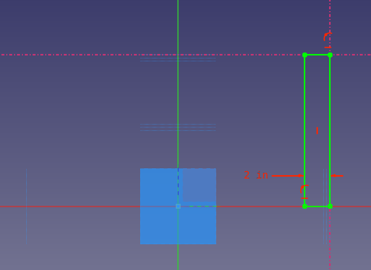</center>

Using the External Geometry tool (keyboard: G-X) we can add the top plane of our top cutout,
and the back plane of our back cutout, and then we can just constrain our rectangle to those
things (and the origin which I'm using as the "floor" of the shelf).

We do need to set the width, which I simply hardcoded here, but for a serious project you
should add these things to the VarSet. Once the sketch is done, drag it onto the Left_sheet
cutout object. It will move under the Left_sheet object in the Tree View, and the Left_sheet
object will now render as a rectangular cutout in the 3D view.

<center>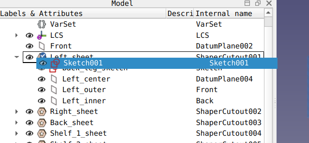</center>

Next, drag the **same sketch** onto Right_sheet. It won't be moved out of the left sheet (to do
that you need to double-click on Left_sheet and remove the sketch in the object editor). Instead,
the same sketch will appear under both sheets.

This is what we want, because these two legs should be identical, but we need to be careful! Any
edits made to the sketch will be applied to both legs, and if you delete the sketch, it will be
deleted from both legs.

<center>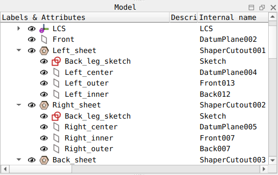</center>

Once you've done this, you'll have two legs in the 3D view.

<center>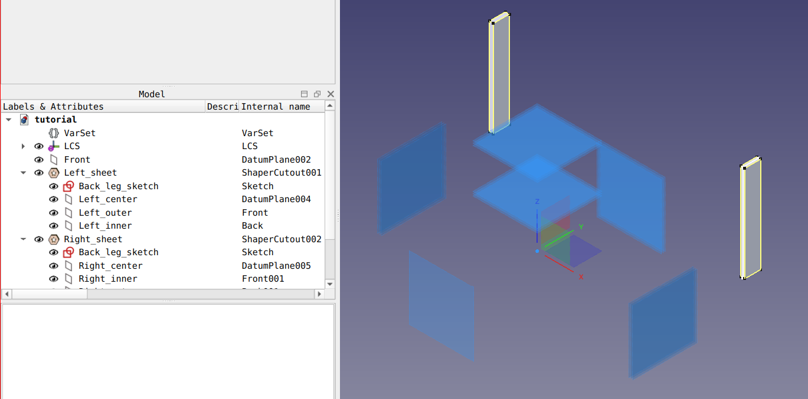</center>

Nice. Let's cut some dados into them so that the shelves can slot into. To do this, again select
the Left_sheet center plane (or any parallel plane that's convenient) and create a new sketch.
This time we just need to add the center planes of the shelves as External Geometry and draw two
lines on them. We don't need to draw rectangles, set width, constrain symmetry, remember to add
tolerance, etc.

<center>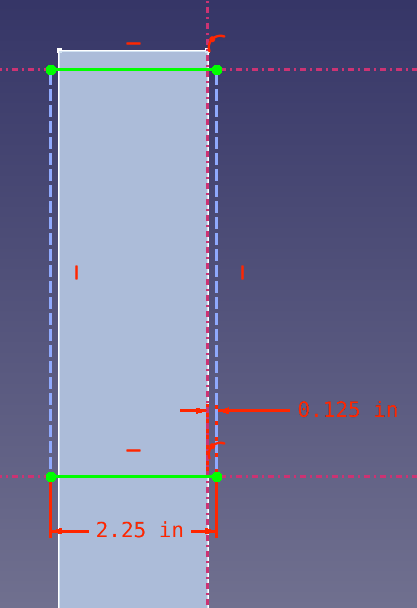</center>

In my sketch I've "overshot" the edges of the leg so that when I cut this with the Shaper I won't
have rounded corners to chisel out.

Next, I drag the dado sketch onto my left leg cutout. Because the cutout already has an outline
sketch, this time a dialog pops up asking me what to do.

<center></center>
<center>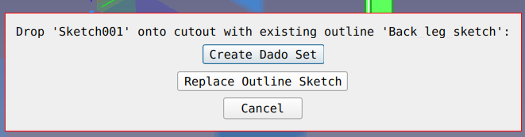</center>

We click the first button, which opens a "Create Dados" dialog. The sketch list has the sketch
we dragged onto the cutout. The numeric fields we fill in with data from our VerSet.

If we'd wanted, we can add multiple sketches to this dado set. We can also have multiple dado
sets, if we wanted to set a different depth or autodrill policy.

<center>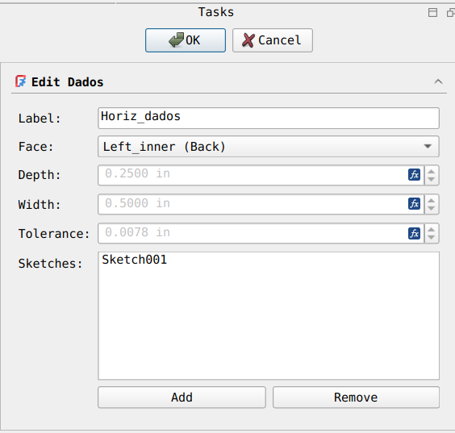</center>

Before moving on, let's demonstrate the autodriller. We don't have a dialog yet, but by editing
properties in the Property Editor, we can add screw holes to our dados. For projects where we
don't want to glue, and don't mind visible screws, this provides precisely spaced screw holes
in your dados.

<center>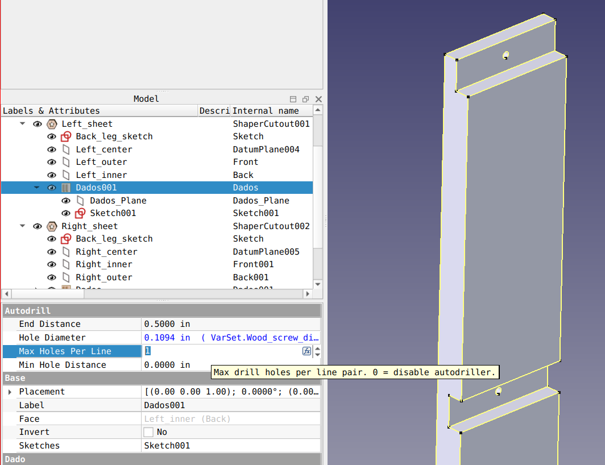</center>

In the same way, create a second dado set with a vertical line that the back panel can fit into.
Then drag both dado sketches (not the outline sketches!) from one side sheet to the other to
create symmetric dados on the other side. (Or drag the whole *dado set* onto the other sheet:
it gets cloned there -- a copy of the settings plus the same sketches -- with the dialog open
so you can adjust it.)

<center>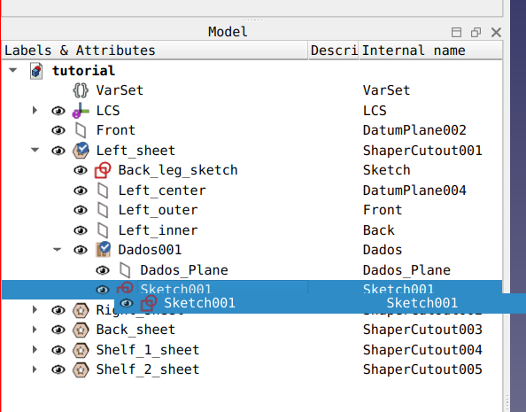</center>
<center>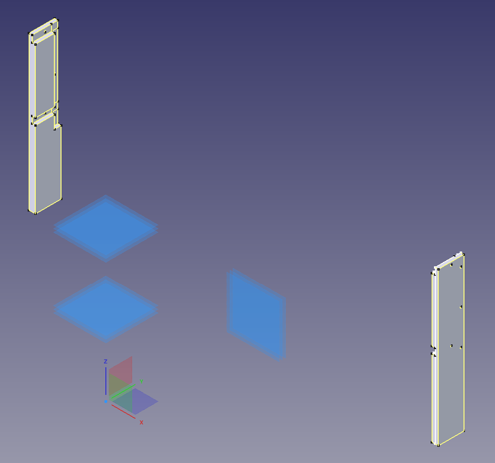</center>

Now that we have our side dados cut, and dado planes automatically created by the workbench, we
can draw our backing sketch. We add the top shelf's top plane, the bottom shelf's bottom plane,
and the two side dado planes as External Geometry.

<center>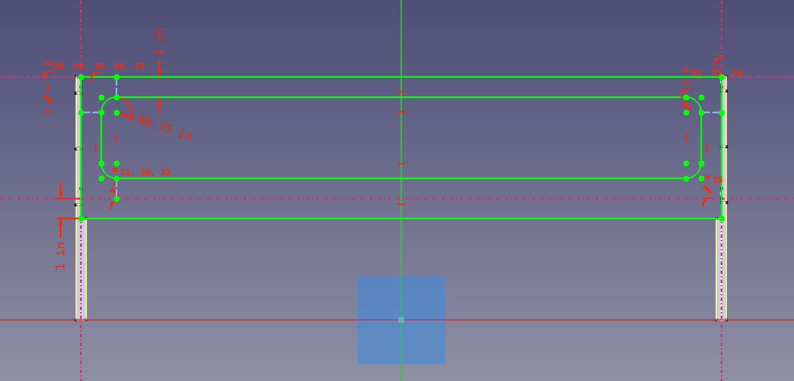</center>
<center>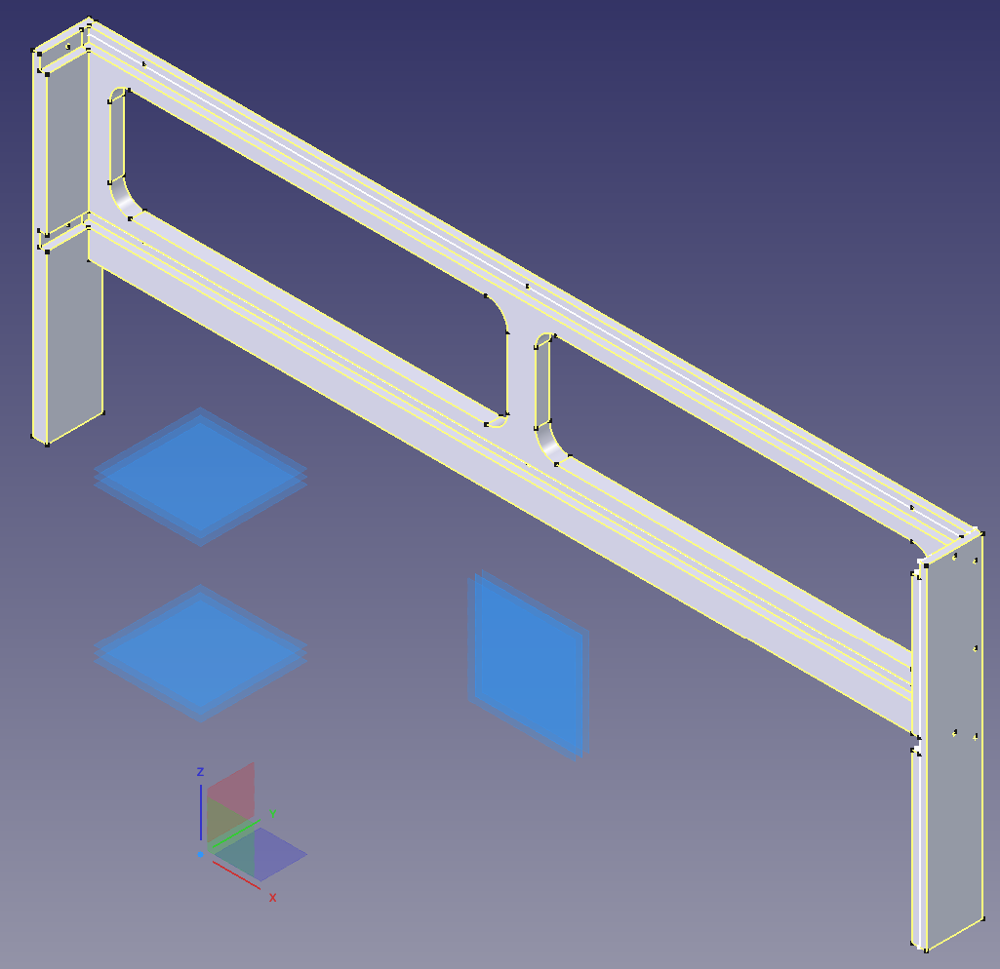</center>

Next, let's add the front legs. Since the front legs will be on the same plane as our back
legs, we do this by *selecting one of the front legs* and then clicking "Create Shaper Cutout".
The dialog will automatically populate with values copied from the other leg (and in fact,
these values will be linked -- try varying the thickness and you'll see the original leg change
thickness as well! If you don't want this behavior, you need to create a new center plane.)

<center>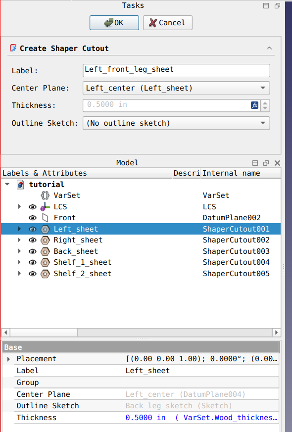</center>

Repeat the process to draw the legs and add some dados for the shelves, and you're done!

<center>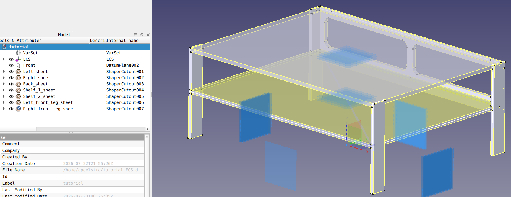</center>

Before continuing to export SVGs for the Shaper, let's go back and edit all our sketches to
look cooler and take advantage of the fact that we have a CNC mill. Alternately, you could
stop here, switch to the TechDraw workbench, and produce dimensioned drawings you can carry
down to the table saw for manual cutting.

Anyway here's what I did:

<center>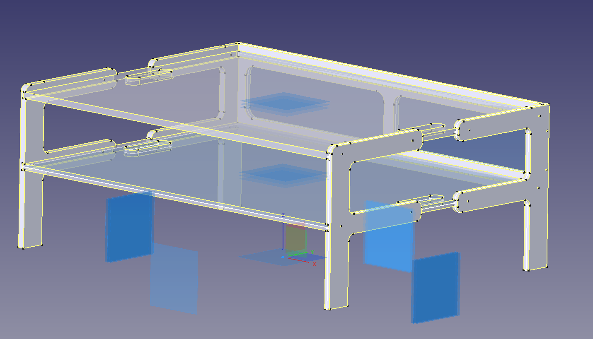</center>

If you want, you can right-click on the individual cutouts in the Tree View and choose "Export to
ShaperSvgPage", which creates a page exactly the size of that cutout, where you can flip it and
preview it before exporting. Since these parts all have dados on only one side, that's the side you
want to export. Instead, let's lay them all out on a single giant 8'x4' sketch that we can lay out
over a whole sheet of plywood.

Start by clicking "Create SVG Page":

<center>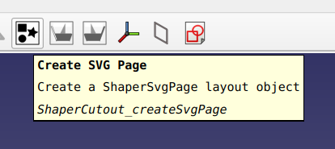</center>

which creates a new SvgPage object.

<center>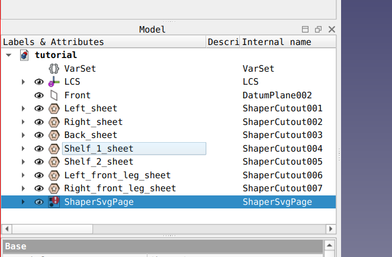</center>

Double-click on this to see a render of it.

<center>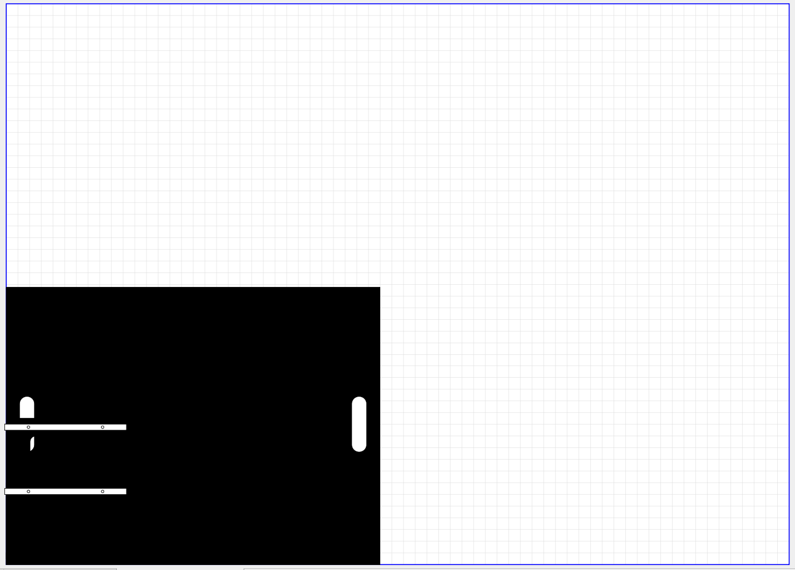</center>

Yikes. All the pieces are on top of each other in the bottom-left corner and we can't tell them
apart. This part of the interface needs a lot of work, but for now it's totally usable. To move
and rotate the pieces, edit the X/Y and Rotation attributes in the Property Editor:

<center>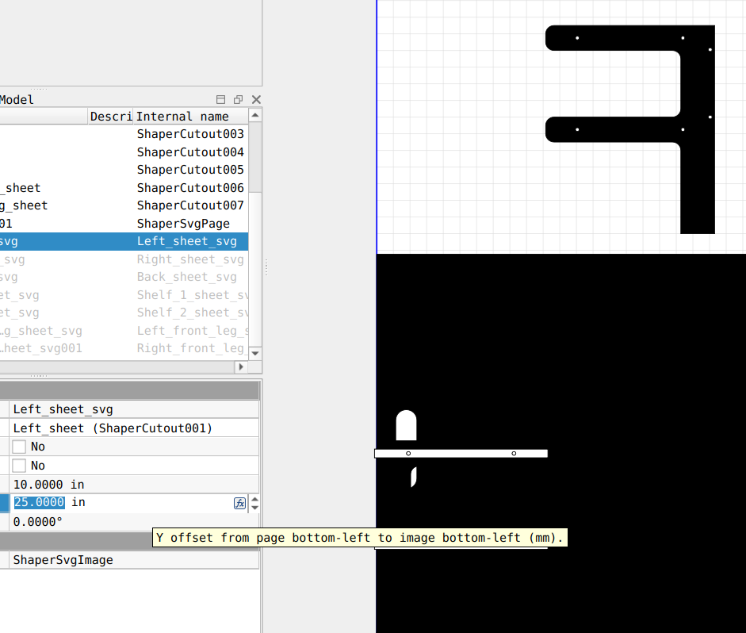</center>

If the wrong side (i.e. the non-dado side) is showing, check the "Flip" box to flip it over.
(If you want to render the same side, but mirrored, check the "Invert" box. This should never
be needed for a project like this where we modeled every individual sheet in its final position
in the 3D view.)

After a bit of work, and resizing the sheet to match the half-cut sheet of plywood in my
garage, I laid everything out to be nonoverlapping.

<center>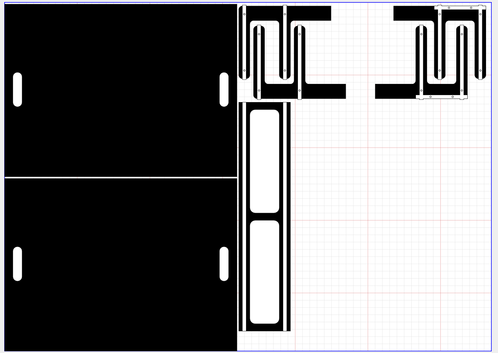</center>

And we're done! Right-click the SVG Page, choose "Export SVG Page", and take it down to the Shaper.

[Complete .FCStd here](./tutorial-images/tutorial.FCStd)

# Gallery

Here is a hybrid bassinet/rocking chair I made with this workbench.

<center>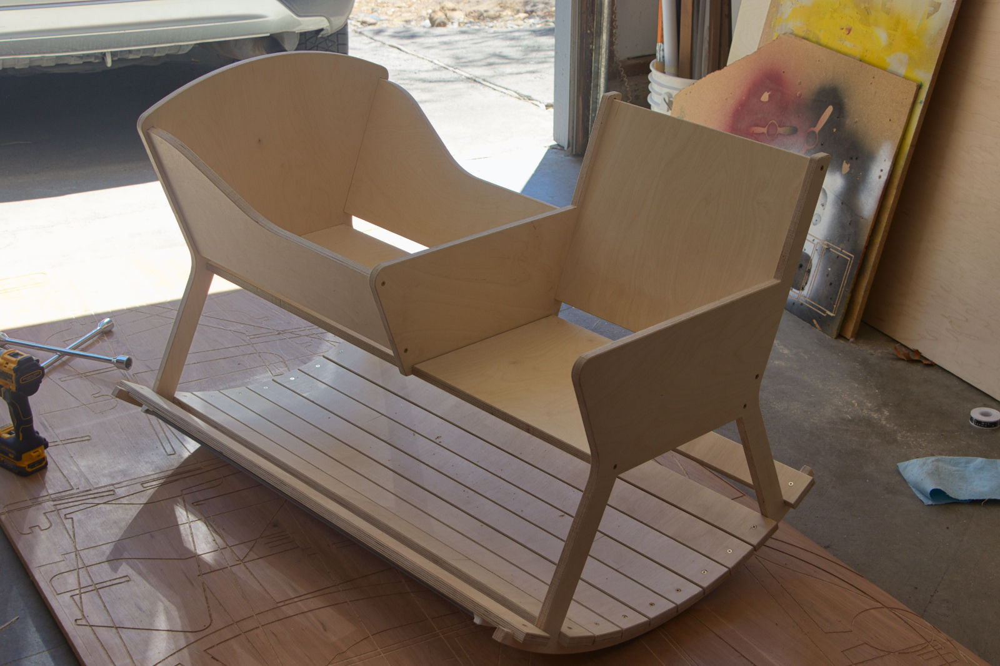</center>

